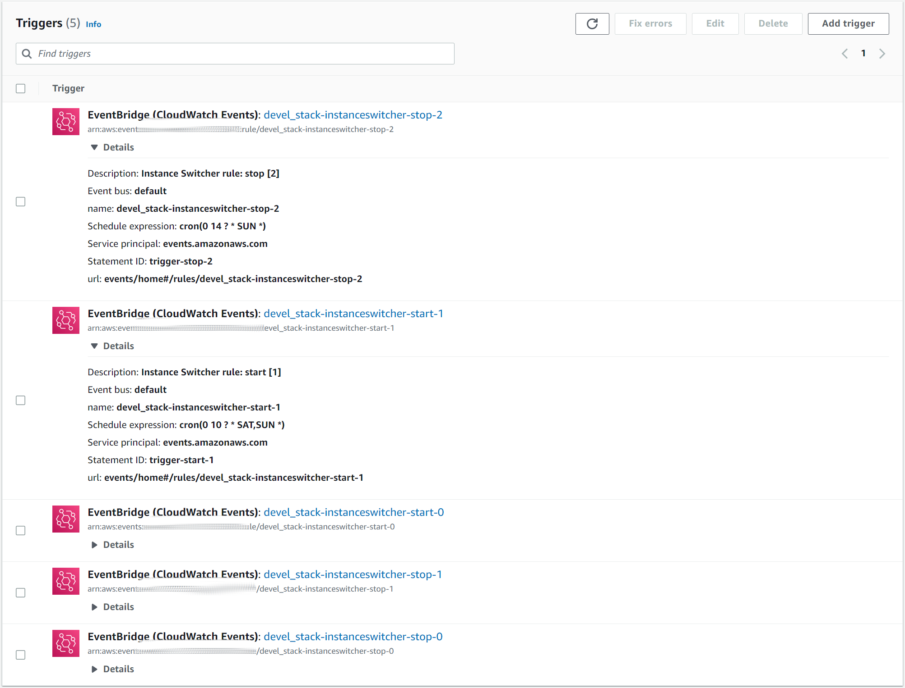

# AWS EC2 Instance Switcher

## start, stop, reboot or terminate AWS EC2 instances on scheduled times

Example use case:

* We want to start a development environment at 8 and stop it at 18 every workday.
* We want to start a development environment at 10 and stop it at 16 on saturdays.
* We want to start a development environment at 10 and stop it at 14 on sundays.

```terraform
module "instanceswitcher" {
  source = "./instanceswitcher"

  # Prefix to be used in created resources
  prefix = "devel_stack"

  # Which instances will be affected
  instance_list = [
    "i-asdfghj123456poiu"
  ]

  # Schedules in cron expression format
  # https://docs.aws.amazon.com/AmazonCloudWatch/latest/events/ScheduledEvents.html#CronExpressions
  schedules = {
    start = [
      "0 8 ? * MON,FRI *",
      "0 10 ? * SAT *",
      "0 10 ? * SUN *",
    ]
    stop = [
      "0 18 ? * MON,FRI *",
      "0 16 ? * SAT *",
      "0 14 ? * SUN *",
    ]
    terminate = []
    reboot    = []
    switch    = []
  }

  tags = {
    Name      = "Dev Maintenance"
    project   = "operations"
    component = "devmaintainer"
  }
}
```

NOTE: you can pass to the `instance_list` the resulting `ids` from an [aws_instances data source](https://registry.terraform.io/providers/hashicorp/aws/latest/docs/data-sources/instances) output.

This code will create 6 EventBridge Rules, one for each scheduled time, that will execute a lambda to perform the action.

EventBridge Rules:


Lambda created to perform the actions with the linked triggers:



